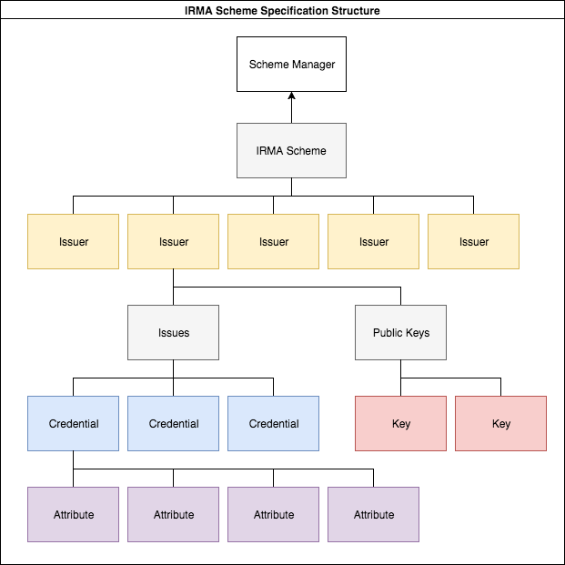

# Decentralizing the IRMA Scheme

Note: This repository contains Research & Development code and work that doesn't necessarily comply with production level standards for code quality and code style. It is provided here 'as is' for research purposes.

Author: Timen Olthof

The IRMA scheme contains the state of the world during IRMA sessions (attribute issuing, disclosing, signing, etc.). It functions as the 'single source of truth' for all parties involved.

The IRMA scheme is managed by a 'scheme manager'. Any party can take up this role but it is important that it is a party that is trusted by everyone and has no stake in the performed IRMA sessions. The IRMA scheme manager never sees any details about performed IRMA sessions. The IRMA app supports using multiple IRMA schemes. The default IRMA scheme is currently managed by the [Privacy by Design Foundation](https://privacybydesign.foundation/).

The responsibilities of the IRMA scheme manager include:

- Making sure the IRMA scheme is publicly available for easy use during IRMA sessions.
- Managing which issuers that are contained in the IRMA schemes
- Storing the cryptographic identity (public keys) and metadata of each issuer
- Making sure that only the issuer can update its own cryptographic identity, issued credentials/attributes and metadata.
- Taking up the role of 'root CA' in a PKI like infrastructure for issuer keys.

## Goal of the project

In this R&D project, we look at how the IRMA scheme currently works and how it might (possibly) be improved.
We have performed the following steps:

- Examine the current implementation of IRMA schemes, including its benefits and drawbacks.
- Research and develop an architecture for a decentralized IRMA scheme. Note that this is possible because the IRMA protocol already supports distribution of scheme manager roles among different parties.
- Create a prototype implementation of an IRMA scheme that uses decentralized storage and access control using Ethereum
- Compare the the current IRMA scheme and the prototype implementation, and draw conclusions.

## In depth: Current implementation (Github)

In its current implementation, the IRMA scheme is managed as a set of files in the [pbdf-schememanager](https://github.com/privacybydesign/pbdf-schememanager) repository on Github.
It contains the following information:

### Data about the scheme

**index** - a plaintext file containing hashes of all files in the repository:

```
ead7826e76106c5bcdc3b3a5f786e600d0a52cb7e8e7670261f44bd91a841289 pbdf/description.xml
00bc2505f94f5b3842113584743e2dca8b158de4e05ab98c42571ce3fee581ac pbdf/pbdf/Issues/ageLimits/description.xml
5231d4ce12e50b0e8a4656eb40e505750e249346806d6d038d6345e22a93771c pbdf/pbdf/Issues/ageLimits/logo.png
[...]
```
**index.sig** - a raw file containing the signature of the index file

**pk.pem** - a file containing the public key of the scheme manager

```
-----BEGIN PUBLIC KEY-----
MFkwEwYHKoZIzj0CAQYIKoZIzj0DAQcDQgAELzHV5ipBimWpuZIDaQQd+KmNpNop
dpBeCqpDwf+Grrw9ReODb6nwlsPJ/c/gqLnc+Y3sKOAJ2bFGI+jHBSsglg==
-----END PUBLIC KEY-----
```

**description.xml** - a file containing an XML definition of the IRMA scheme metadata, for example:

```
<SchemeManager version="7">
	<Id>pbdf</Id>
	<Url>https://privacybydesign.foundation/schememanager/pbdf</Url>
	<Name>
		<en>Privacy by Design Foundation</en>
		<nl>Stichting Privacy by Design</nl>
	</Name>
	<Description>
		<en>The Privacy by Design Foundation develops the IRMA app and the IRMA infrastructure, and issues basic attributes for free.</en>
		<nl>De stichting Privacy by Design ontwikkelt de IRMA app en de IRMA infrastructuur, en geeft gratis een set basisattributen uit.</nl>
	</Description>
	<KeyshareServer>https://privacybydesign.foundation/tomcat/irma_keyshare_server/api/v1</KeyshareServer>
	<KeyshareWebsite>https://privacybydesign.foundation/mijnirma/</KeyshareWebsite>
	<KeyshareAttribute>pbdf.pbdf.mijnirma.email</KeyshareAttribute>
	<Contact>https://privacybydesign.foundation/</Contact>
</SchemeManager>
```

**<issuer>/** - a folder for each issuer in the scheme. Each folder is named by the `issuerId` of the issuer that it describes (in our example case this folder might be named `pbdf`). Each folder contains data for one Issuer.

### Data about each Issuer

Each folder contains the schema data pertaining to that Issuer:

**logo.png** - an image file containing a logo for the Issuer

**description.xml** - a file containing an XML definition of the Issuer, for example:

```
<Issuer version="4">
	<ID>pbdf</ID>
	<ShortName>
		<en>PbD.f</en>
		<nl>PbD.f</nl>
	</ShortName>
	<Name>
		<en>Privacy by Design Foundation</en>
		<nl>Stichting Privacy by Design</nl>
	</Name>
	<SchemeManager>pbdf</SchemeManager>
	<ContactAddress></ContactAddress>
	<ContactEMail>info@privacybydesign.foundation</ContactEMail>
	<baseURL></baseURL>
</Issuer>
```

**PublicKeys/** - a folder containing the public key(s) of the issuer. The files in this folder are named `0.xml`, `1.xml`, `2.xml` etc.

- IRMA Issuer keys have an expiry date, this is one of the reasons multiple keys can be included for every issuer.
- IRMA Issuer keys are structured in XML format, for example `0.xml`:

```
<?xml version="1.0" encoding="UTF-8" standalone="no"?>
<IssuerPublicKey xmlns="http://www.zurich.ibm.com/security/idemix">
   <Counter>0</Counter>
   <ExpiryDate>1509100474</ExpiryDate>
   <Elements>
      <n>153083626846953041148798984867206431967476314548248599675213756172644063474530260495216333346051157056954585429878833407616458713470258614557644549055442336816765036994343083706077637150817233586215957823887604466160968116348696406527285353127675492765345080512715060583469637176051691364962519805621590733473</n>
      <Z>151145812782966949004562123511348360915116849203600768286954722250271879925704384516978099406159776962580833602916965512771761193134735415560803760227980183523828836195681657377097451091691150194016329773950347273245413663949426820549440343819565194141128790683089713015200119110876669077666902685958565588052</Z>
      <S>12312959352926251135494460490921161934091634286217473593489364830603639867013234990280140537834447349617690724678772590211285489304226992425280976827684960652990650901939858111822201353449384669401038093259267422292728115066715560921099291332761199984328277806112630508352069021431703076854924493715632084017</S>
      <Bases num="20">
         <Base_0>33782263087307562864480900198045833374750619733798476098212578035590943035435908463276779959724126424200275797822368649153968236010770095399382254627624062049873397397148222688098561316951905533280118904360834591505517638401560113752147680276096553203012894130910046851906811597361183525806497169535320267797</Base_0>
         <Base_1>[...]</Base_2>
         [...]
         <Base_19>[...]</Base_19>
      </Bases>
   </Elements>
   <Features>
      <Epoch length="432000"></Epoch>
   </Features>
</IssuerPublicKey>
```

**PrivateKeys/** (optional) - an optional folder containing the private key(s) of the issuer, in the same format as the public key(s).

**Issues/** - a folder containing a subfolder for each credential this Issuer issues, for example `ageLimits` or `big`.

### Data about each credential

Each subfolder in the `Issues`-folder inside an `<Issuer>`-folder contains the schema data pertaining to that credential issued by that Issuer:

**logo.png** - an image file containing a logo for the credential

**description.xml** - a file containing an XML definition of the credential, for example:

```
<IssueSpecification version="4">
	<Name>
		<en>Age limits</en>
		<nl>Leeftijdslimieten</nl>
	</Name>
	<ShortName>
		<en>Age</en>
		<nl>Leeftijd</nl>
	</ShortName>
	<SchemeManager>pbdf</SchemeManager>
	<IssuerID>pbdf</IssuerID>
	<CredentialID>ageLimits</CredentialID>
	<Description>
		<en>Your age attributes, issued after revealing your birthdate, e.g. from the iDIN bank credentials.</en>
		<nl>Uw leeftijdsgrenzen zoals berekend uit uw geboortedatum, bijvoorbeeld uit een iDIN bank credential.</nl>
	</Description>
	<ShouldBeSingleton>true</ShouldBeSingleton>

	<Attributes>
		<Attribute id="over12">
			<Name>
				<en>Over 12</en>
				<nl>Ouder dan 12</nl>
			</Name>
			<Description>
				<en>If you are over 12</en>
				<nl>Of u ouder dan 12 bent</nl>
			</Description>
		</Attribute>
		<Attribute id="over16">
			<Name>
				<en>Over 16</en>
				<nl>Ouder dan 16</nl>
			</Name>
			<Description>
				<en>If you are over 16</en>
				<nl>Of u ouder dan 16 bent</nl>
			</Description>
		</Attribute>
		<Attribute id="over18">
			<Name>
				<en>Over 18</en>
				<nl>Ouder dan 18</nl>
			</Name>
			<Description>
				<en>If you are over 18</en>
				<nl>Of u ouder dan 18 bent</nl>
			</Description>
		</Attribute>
		<Attribute id="over21">
			<Name>
				<en>Over 21</en>
				<nl>Ouder dan 21</nl>
			</Name>
			<Description>
				<en>If you are over 21</en>
				<nl>Of u ouder dan 21 bent</nl>
			</Description>
		</Attribute>
		<Attribute id="over65">
			<Name>
				<en>Over 65</en>
				<nl>Ouder dan 65</nl>
			</Name>
			<Description>
				<en>If you are over 65</en>
				<nl>Of u ouder dan 65 bent</nl>
			</Description>
		</Attribute>
	</Attributes>
</IssueSpecification>
```

### F.A.Q. after in depth analysis

- Why is XML used for metadata?  (*historical implementation choice*)
- Why are lowercase, CamelCase and CAPS used together? (*differences in naming conventions between different platforms/languages*)
- Does every scheme need to have a keyshareserver? (*no, scheme managers can choose to support one, and it might also be organized in a different way (for example the user supplying his own key sharing server*))
- What is the purpose of the keysharing server? (*to protect the attributes on the user's phone against abuse*)
- Why are there multiple public keys for each Issuer? (*to be able to perform key rotation, while preserving the old keys such that previously issued attributes can (optionally) remain (historically) valid*)
- Why is XML used as format for Issuer keys? (*historical implementation choice*)
- What is the meaning of ShouldBeSingleton? (*users can only posses one attribute of this type at the same time*)

### Image of IMAGE scheme data model (normalized)



## Drawbacks of the current implementation (Github)

- The Privacy by Design Foundation needs to be trusted by everyone in managing the content of the IRMA scheme
- Github needs to be trusted by everyone in distributing the IRMA scheme content

It should be noted that this 'trust' is not only a case of trusting the organization that manages the Github repository to be objective and to perform its responsibilities in an appropriate manner, but also a case of trusting organization of the practical and security aspects of performing this role. Practical aspects include trusting the scheme manager to set up useful an dependable practices with regards to adding and updating issuers, while security aspects for example include the robustness of the webservers and the validity of SSL certificates that protect transport security (which is partially delegated to Github in the case of hosting on Github).

## Solving these issues: decentralization

From these drawbacks it follows that a potentially better implementation of the IRMA scheme (manager) should ideally provide the following functional characteristics:

- Decentralized IRMA scheme: no central party is needed to manage the contents of the IRMA scheme
- Decentralized distribution of the IRMA scheme: no central server is needed to distribute the contents of the IRMA scheme

Of course these two characteristics do not necessary have to go together, and achieving one of them would be an improvement as well.

## Designing an IRMA Scheme on the Ethereum Blockchain

Blockchainlike solutions like [Ethereum](https://www.ethereum.org/) ("a decentralized platform that runs smart contracts: applications that run exactly as programmed without any possibility of downtime, censorship, fraud or third-party interference.") and [IOTA](https://iota.org/) (a "decentralized and self-regulating peer-to-peer network") claim that they offer ways to store and distribute trusted data that can be managed by the owners of data without the need to trust a central party.

These solutions are therefore good candidates to solve the issues with the current implementation, at least in an experimental implementation, given the maturity levels of these relatively new technologies. Since the IRMA scheme is concerned primarily with storing a single source of truth about IRMA issuers, in our prototype implementation for a decentralized scheme (manager) we design a smart contract holding this information using the Ethereum blockchain. To be as compatible as possible with existing IRMA implementations, we mirror the data stored in the IRMA scheme smart contract with the data currently stored in the IRMA schemes on Github, and don't concern ourselves with changing or optimizing the structure and content of the data stored.

This leads to the following architecture related to the 'identity' of IRMA scheme contracts:

- Each live IRMA Scheme contract is identified by its Contract address as well as its 'textual' scheme identifier.
- We use a single smart contract for storing the entire IRMA scheme. Alternatively a hierarchy of contracts could be used, but this complicates code that interacts with the scheme, since it will have to look up and manage multiple smart contracts.
- IRMA schemes currently have unique scheme ids but they are only guaranteed to be unique by the scheme manager. In the future a separate contract could be used to manage the 'registration' of scheme contracts by their id's. This will effectively create a 'super'-scheme that is a trusted list of active schemes.

### Storing Scheme data on blockchain

**index** - no longer needed, because Blockchain provides data integrity

**index.sig** - no longer needed, because Blockchain provides data integrity

**pk.pem** - instead of storing the public key of the scheme manager, the contract stores the address of the owner of the contract. Optionally it would be possible to not have a scheme owner at all (making the scheme truly decentralized).

**description.xml** - Instead of XML, contract data structures are used for storing IRMA scheme metadata. Note that most of this metadata is not required for the protocol to work. A human readable name for the scheme is nice, but there would be no guarantee on the unique value of this name. Only the contract address would be a guaranteed unique property to identify the scheme with.

This leads to the following list of scheme contract properties:

- version (int)	-> `7`
- owner (Address) -> `Ethereum address set during creation of the contract`
- id (string) -> `"pbdf"`
- url (string) -> `"https://privacybydesign.foundation/schememanager/pbdf"`
- name (Map lang -> name) -> `"en" -> "Privacy by Design Foundation"`
- description (Map lang -> description) -> `"en" -> "The Privacy by Design Foundation develops the IRMA app and the IRMA infrastructure, and issues basic attributes for free."`
- keyshareserver (string) -> `"https://privacybydesign.foundation/tomcat/irma_keyshare_server/api/v1"`
- keysharewebsite (string) -> `"https://privacybydesign.foundation/mijnirma/"`
- keyshareattribute (string) -> `"pbdf.pbdf.mijnirma.email"`
- contact (string) -> `"https://privacybydesign.foundation/"`

**<issuer>/** - instead of a folder, a mapping from ids to issuers is stored.

### Data about each Issuer

**logo.png** - because storing data on a blockchain is expensive, we store an image URL instead of an actual image

**description.xml** - Instead of XML, contract data structures are used for storing IRMA Issuer metadata. This leads to the following list of issuer struct fields:

- version (int) -> `4`
- id (string) -> `"pbdf"`
- owner (Address) -> `ethereum address set when adding an issuer to the scheme`
- shortName (Map lang -> shortName) -> `"en" -> "PbD.f"`
- name (Map lang -> name) -> `"en" -> "Privacy by Design Foundation"`
- contactAddress (string) -> `""`
- contactEmail (string) -> `"info@privacybydesign.foundation"`
- baseUrl (string) -> `""`

**PublicKeys/** - managed as a data structure of keys in the scheme contract:

Numbers are stored as strings/bytearrays because they are very big (they don't fit the integer data structure). For each public key, the following properties are stored:

- Counter -> `0`
- ExpiryDate -> `1509100474`
- N -> `"153083626846953041148798984867206431967476314548248599675213756172644063474530260495216333346051157056954585429878833407616458713470258614557644549055442336816765036994343083706077637150817233586215957823887604466160968116348696406527285353127675492765345080512715060583469637176051691364962519805621590733473"`
- Z -> `"151145812782966949004562123511348360915116849203600768286954722250271879925704384516978099406159776962580833602916965512771761193134735415560803760227980183523828836195681657377097451091691150194016329773950347273245413663949426820549440343819565194141128790683089713015200119110876669077666902685958565588052"`
- S -> `"12312959352926251135494460490921161934091634286217473593489364830603639867013234990280140537834447349617690724678772590211285489304226992425280976827684960652990650901939858111822201353449384669401038093259267422292728115066715560921099291332761199984328277806112630508352069021431703076854924493715632084017"`
- R -> `"652990650901939858111822201353449384669401038093259267422292728115066715560921099291332761199984328277806112630508352069021431703076854924"`
- EpochLength -> `432000`

**PrivateKeys/** (optional) - these are (obviously) not stored on the blockchain

**Issues/** - managed as a data structure of credentialSpecifications in the scheme contract

### Data about each credential

Each subfolder in the `Issues`-folder inside an `<Issuer>`-folder contains the schema data pertaining to that credential issued by that Issuer:

**logo.png** - because storing data on a blockchain is expensive, we store an image URL instead of an actual image. Of course this means there is a greater availability problem with the images then there is in the current Github implementation, because image urls could be at many different hosting locations with different availability. Since images are relatively easy to cache or replicate using CDN's or for example using something like ipfs, this is not a very difficult technical problem in practice.

**description.xml** - Instead of XML, contract data structures are used for storing IRMA credential specifications. This leads to the following list of credential struct fields:

- version (int) -> `4`
- schemeManager (string) -> `"pbdf"`
- issuerId (string) -> `"pbdf"`
- credentialId (string) -> `"pbdf"`
- shortName (Map lang -> shortName) -> `"en" -> "Age"`
- name (Map lang -> name) -> `"en" -> "Age Limits"`
- description (Map lang -> description) -> `"en" -> "Your age attributes, issued after revealing your birthdate, e.g. from the iDIN bank credentials."`
- shouldBeSingleton (boolean) -> `true`
- attributes (array of Attribute) -> `[AttributeXML]`

Note: the CredentialSpecification data structure was not completely implemented in the contract because of time constraints. Instead of implementing all fields of the credential data separately, the following structure was used:

- credentialId (string) -> `"pbdf"`
- logoUrl (string) -> `"http://logo.png"`
- credentialSpec (bytes) -> `[CredentialSpec]`

## Technical Implementation

### Tools and languages used

- Ganache-cli [https://github.com/trufflesuite/ganache-cli](https://github.com/trufflesuite/ganache-cli) - to run a private testrpc Ethereum blockchain
- geth [https://github.com/ethereum/go-ethereum/wiki/geth] - command line interface for local Ethereum node
- go-ethereum [https://github.com/ethereum/go-ethereum](https://github.com/ethereum/go-ethereum) - Ethereum bindings for Golang
- irmago [https://github.com/privacybydesign/irmago](https://github.com/privacybydesign/irmago) - For integration of IRMA with applications, and integration of the Ethereum IRMA scheme with IRMA
- web3 [https://github.com/ethereum/web3.js/](https://github.com/ethereum/web3.js/) - JavaScript library for communicating with Ethereum
- protocol buffers [https://github.com/google/protobuf](https://github.com/google/protobuf) - to serialize datastructures so they can be stored on Ethereum and take as little space (and the lowest transaction costs) as possible

### Frontend

The project contains a very simple (frontend)[frontend] that can be used to create new IRMA schemes on Ethereum, and read IRMA scheme data from Github or Ethereum. It is included for demo purposes only.

### Integration in irmago

Previously, one would have called `conf.ParseFolder()` to load a file based (Github) scheme:

```
conf, err := irma.NewConfiguration("irma_configuration", "")
if err != nil {
	fmt.Println(err)
}

err = conf.ParseFolder()
if err != nil {
 	fmt.Println(err)
}
```

To use an Ethereum scheme in `irmago`, a new parsing function `conf.InitAndParseEthereumContract()` was added:

```
conf, err := irma.NewConfiguration("irma_configuration", "")
if err != nil {
	fmt.Println(err)
}

err = conf.InitAndParseEthereumContract("0xcb3afbcc401d7089f3e54649d76f296ac0131ac1")
if err != nil {
	fmt.Println(err)
}
```

Note: irmago parses the entire file based scheme on startup. As the scheme(s) grow, this will affect startup time accordingly, which means that it does not scale. A more scalable approach would be to only read (the parts of) the scheme(s) that are required in a given `irmago` call (this doesn't have anything to do with the source, file or ethereum). A hybrid approach would be to load any schemes data that is locally available on startup, and fetch additional (partial) schemes 'just in time' as they are needed.

## Conclusions, observations and further work

**Conclusions**

- The fact that anyone can start his or her own scheme is a very powerful feature of the IRMA protocol.
- It is in fact very doable to run such a scheme on Ethereum and give it features that blockchain like systems support (such as each issuer managing it's own (meta)data in a secure manner).
- Storing data structures on Ethereum is relatively cumbersome. This is especially sad since a lot of data is relatively static.
- There is no immediate advantage of decentralizing the scheme for schemes that have a relatively 'official' (central) status, which is true for the schemes that are most important in the short term (such as Government or organizational schemes)
- There could be advantages in decentralizing schemes in the long term when pki is more decentralized (for example when people build their address books of reliable issuers themselves). In any case the IRMA protocol would be very compatible in supporting more decentralized schemes.
- In general for people to collaborate based on self sovereign identities, it is still required for participants to have a shared understanding of who are valid issuers, because attributes (attestations) are only valuable if the same issuer is accepted by both relying party and attribute subject. This necessarily leads to some degree of central organization of issuers (in any self sovereign identity system).

**Observations**

- Decentralizing the IRMA scheme does not solve the problem of how to establish that particular issuers and verifiers are the legal parties they claim to be. This always requires some 'root CA' role to start a trust chain, either directly or indirectly through existing trust chains such as SSL or DNS (which have their own problems).
- Of course such a 'root CA' is always some single authority again, although this role might be decentralized a bit in the form of for example 'Trusted Nodes' or 'Stewards'.
- Decentralizing the 'root CA' role would be very powerful, and would fit the technological model of peer 2 peer or blockchain based solutions very well. The hard part of this problem is how 'the crowd' could publicly attest to a certain issuer being a certain real world party, without losing privacy of the attestor (this requires some type of anonymous yet valuable proof of work to protect against spam/fake attestations).

**Problems**

- Transaction costs are an important issue in blockchain systems. They provide the incentive for miners (or less energy consuming nodes) to keep the infrastructure 'up'. The current limits for transaction size sometimes require transactions that are functionally atomic to be split up in multiple parts, which is not ideal.
- Data typing features of Solidity are very limiting. There is very limited support for complex dynamic objects and arrays, which makes it more difficult then necessary to store data on Ethereum. In particular, Ethereum is very bad in storing dynamicly sized hierarchies.
- A general problem with decentralized systems is the need for every participant to run their own network node. In theory any node could be used to access a decentralized communication network such as Ethereum, but in that case the node that is used to connect must be trusted by the connecting application, which partially defeats the purpose of using a p2p network altogether. An important aspect in the adoption of p2p and other decentralized systems will be easy means to integrate networking features into existing apps and systems, so that they do not have to rely on 'trusted middle men' systems.

**Possible solutions**

- A possible workaround for the problems related to the size and data stored on Ethereum and the derived high transaction costs are methods in which parts of the data are not stored on the Ethereum chain, but in other systems, on side chains, or on different kinds of p2p systems (like IPFS) that might better fit the IRMA case. These systems also have drawbacks, for example the incentive for nodes to keep the network 'up' and data 'available' is less well developed in pure data storage systems like IPFS than it is in smart contract systems like Ethereum.
- A solution that was already implemented in this prototype, is storing data in a non-native format (in this case protobuffs). This works, but introduces an additional layer of complexity into the system. Another downside is that is makes the contract data unreadable without the right specification for interpretation of the contract data.

**Further work***

- It would be good to use the DID specification for IRMA schemes (and issuers), so that schemes from different sources can be uniquely identified regardless of their source.
- Compare the current implementation on Ethereum with possible implementations using other technologies for decentralization, such as IOTA or IPFS.
- The IRMA mobile app contains at least one scheme preloaded in the app, and has the ability to register additional schemes in the app using QR codes. To enable Ethereum schemes in the mobile app, it should be able to connect to Ethereum (either by being it's own node or using a trusted node), and the QR code reader should be able to deal with pointers to Ethereum IRMA scheme contracts.
